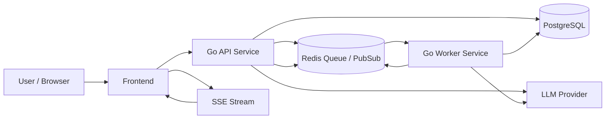

# FlowForge — Architecture Document v3

**Status:** Draft v3
**Target:** Portfolio-grade MVP with production-ready structure
**Architecture Style:** Modular monolith with separately deployable API and Worker processes
**Primary Goal:** Build a simplified workflow automation platform inspired by Zapier and n8n, with strong execution correctness, tenant isolation, safe concurrency, and clear room for scaling.

---

## 1. Architecture Goals

The architecture must support:

- Multi-tenant isolation
- Workflow CRUD and versioning
- DAG validation and deterministic execution
- Manual workflow triggering
- Real-time execution updates
- Run history and logs
- One AI-assisted feature
- Horizontal worker scaling
- Safe concurrency with bounded goroutines
- Local development with Docker Compose
- Clean evolution path to production deployment

The system should be simple enough for a solo developer to build, but structured enough to look like a real workflow automation product.

---

## 2. Core Architectural Decisions

### 2.1 Modular monolith

The codebase is one repository and one domain model, but runtime is split into separate entrypoints:

- `cmd/api` for REST API and SSE
- `cmd/worker` for background execution

A scheduler is **not** a separate process in the MVP. Cron-like behavior, if added later, can be introduced as an internal package or a third runtime entrypoint only when needed.

### 2.2 PostgreSQL as source of truth

All important workflow and execution state lives in PostgreSQL:

- tenants
- users
- workflows
- workflow versions
- workflow runs
- step runs
- execution logs

### 2.3 Queue abstraction

The worker does not depend directly on business logic tied to a specific queue vendor. The application should define a small queue interface and keep Redis/Asynq as the first implementation.

### 2.4 Worker-safe concurrency

The worker must use:

- bounded goroutine pools
- `context.Context` for cancellation
- atomic DB claims for runs and steps
- idempotent execution where possible
- explicit ownership of goroutines and channels

### 2.5 Event-driven monitoring

Workers publish execution events. The API streams them to the frontend over SSE.

### 2.6 Security-first execution

HTTP tasks must include SSRF protection. Script execution must be sandboxed or heavily restricted. AI prompts must not include secrets.

---

## 3. System Overview

### 3.1 Main components

- **Frontend (Next.js / React + TypeScript)**
  - Workflow list
  - Workflow editor
  - Run history
  - Run detail and logs
  - Dashboard
  - AI workflow helper

- **API Service (`cmd/api`)**
  - Authentication and authorization
  - Workflow CRUD and versioning
  - Trigger endpoint
  - Run history and logs endpoints
  - SSE stream endpoint
  - AI endpoint

- **Worker Service (`cmd/worker`)**
  - Claims workflow runs from queue
  - Validates DAG before execution
  - Executes steps
  - Persists step and run state
  - Publishes execution events

- **PostgreSQL**
  - Source of truth for all durable state

- **Redis**
  - Queue backend
  - Event fan-out helper
  - Short-lived coordination data

- **LLM Provider**
  - Used only for the AI feature

---

## 4. High-Level Architecture



### Notes

- The API owns request/response lifecycle and live streaming.
- The Worker owns execution lifecycle.
- PostgreSQL is authoritative.
- Redis is operational support, not system of record.

---

## 5. Runtime Model

### 5.1 API process

Responsibilities:

- login and token refresh
- tenant-aware authorization
- workflow CRUD
- version publish and rollback
- manual trigger
- read-only run views
- SSE streaming
- AI request handling

### 5.2 Worker process

Responsibilities:

- claim pending runs
- load workflow version
- validate DAG
- execute steps with bounded parallelism
- persist outputs, retries, and failures
- publish events

### 5.3 Process scaling

- API can scale horizontally if request load increases.
- Worker can scale horizontally based on queue depth.
- Each worker instance is stateless except for in-memory execution state of the currently running job.

---

## 6. Domain Boundaries

### 6.1 Tenant boundary

Every tenant-owned record includes `tenant_id`.
Tenant-scoped repositories must always filter by tenant.

### 6.2 Workflow boundary

A workflow has:

- metadata
- versioned graph definition
- publication state

### 6.3 Execution boundary

A workflow run is always tied to one workflow version.
A step run belongs to exactly one workflow run.
Logs belong to a workflow run and optionally a step run.

---

## 7. Recommended Backend Code Structure

```text
backend/
  cmd/
    api/
    worker/
  internal/
    auth/
    tenant/
    workflow/
    workflowversion/
    run/
    engine/
    task/
    executor/
    realtime/
    ai/
    platform/
      postgres/
      redis/
      queue/
      config/
      clock/
  migrations/
  tests/
```

### Boundary rules

- `engine` must not import HTTP framework code.
- `task` defines node behavior.
- `executor` contains step execution implementations.
- `run` owns workflow run and step run persistence.
- `platform` contains adapters and external dependencies.

---

## 8. Workflow Definition Model

### 8.1 MVP node types

- `HTTP`
- `DELAY`
- `CONDITION`
- `TRANSFORM`

### 8.2 Definition requirements

A workflow definition must include:

- node list
- edge list
- timeout
- retry policy
- tenant-scoped metadata

### 8.3 Workflow rules

- The graph must be a DAG.
- Cycles must be rejected.
- Every edge must point to valid nodes.
- Every node must have a supported type.
- A published version must be immutable.

---

## 9. Execution Engine Design

### 9.1 Execution Plan Builder

The Execution Plan Builder is responsible for transforming a workflow graph into a deterministic execution plan.

Responsibilities:

- Validate the workflow graph.
- Detect cycles.
- Compute execution order.
- Group parallel executable nodes.

Implementation:

- Topological sorting uses **Kahn's Algorithm**.
- Cycle detection is performed during graph traversal.
- The generated execution plan is deterministic and independent of node insertion order.

Output:

- Ordered execution stages.
- Parallel execution groups.

### 9.2 Execution flow

1. API creates a workflow run in `pending`.
2. API enqueues the run.
3. Worker claims the run atomically.
4. Worker loads the workflow version graph snapshot (`graph_snapshot` JSONB column) for fast, atomic, and race-free DAG parsing.
5. Worker validates the DAG.
6. Worker initializes execution state.
7. Worker executes ready nodes with bounded parallelism.
8. Worker persists step results.
9. Worker emits events after each state transition.
10. Worker finalizes the run as succeeded, failed, timed_out, or cancelled.

### 9.3 Engine responsibilities

The engine should only be responsible for:

- DAG validation
- topological ordering
- dependency tracking
- readiness calculation
- state transitions

The engine should not know about:

- HTTP routing
- queue implementation details
- SSE transport
- LLM provider details

### 9.4 Execution coordinator

The worker should contain an explicit coordination layer between queue consumption and step execution.

#### Responsibilities

- atomically claim a workflow run
- load the workflow version and execution context
- initialize step state
- coordinate DAG traversal and step scheduling
- persist state transitions
- publish run/step events
- collect logs and final execution metadata
- finalize success, failure, timeout, or cancellation

#### Why it matters

This separation keeps the engine pure and testable while moving persistence, orchestration, and side effects into one explicit layer. It also makes worker scaling safer because only the coordinator mutates durable execution state.

### 9.5 Step executors

Each node type has a dedicated executor:

- HTTP executor
- Delay executor
- Condition executor
- Transform executor

This makes new node types easier to add later.

---

## 10. Concurrency Model, Recovery, and TDD

### 10.1 Concurrency rules

- Every execution path must accept `context.Context`.
- Every goroutine must have a clear owner.
- Every goroutine must end when the context is canceled.
- Every channel must be closed by its owner only.
- Bounded worker pools must limit parallel step execution.

### 10.2 Recommended pattern

Use a bounded pool or `errgroup`-style control for parallel branches.

Avoid:

- unbounded goroutine spawning
- shared mutable maps without locking
- background goroutines without cancellation
- anonymous goroutines that cannot be tracked

### 10.3 Race condition prevention

Use these guardrails:

- atomic DB claim for runs
- atomic DB claim for steps
- write-once state transitions where possible
- immutable workflow versions
- explicit locking only around in-memory execution state

### 10.4 Goroutine leak prevention

Rules:

- tie every long-running worker to a context
- stop event listeners on context cancel
- make retry loops respect deadline
- avoid goroutines blocked forever on channels
- always drain or close channels intentionally

### 10.5 Concurrency control strategy

FlowForge should use a hybrid locking strategy.

#### Optimistic locking

Use for editable resources such as workflow drafts and metadata.

- Add a `version` or `updated_at` guard on workflow updates.
- Reject stale writes when the record has changed since it was loaded.

#### Pessimistic locking

Use for execution claims where duplicate work must not happen.

- Use row-level locking or atomic claim queries for runs and steps.
- Prefer `UPDATE ... WHERE status = 'pending' RETURNING id` or `SELECT ... FOR UPDATE SKIP LOCKED` for worker claims.

#### Atomic claim

Use for:

- workflow run claim
- step claim
- idempotent trigger deduplication

#### Idempotency

- Manual trigger endpoints should accept an `Idempotency-Key`.
- Triggered runs should be deduplicated by tenant + workflow + idempotency key.
- Step executors should avoid repeating completed work if a worker restarts.

### 10.6 Failure recovery strategy

The system must recover safely from runtime failures.

#### Retry

- Step retries use exponential backoff.
- Retry budget is stored in workflow version or step config.
- Retry state must be persisted so worker restarts do not lose attempt count.

#### Timeout

- Each workflow run has a global deadline.
- Each step may also have a step-level timeout.
- Deadline expiration must mark the run as `timed_out`.

#### Worker restart

- A worker restart must not lose durable run state.
- On startup, workers can pick up new runs from the queue only.
- A crashed worker should not be able to double-commit a completed step because step claims are atomic.

#### Crash recovery

- Durable state in PostgreSQL is the source of truth.
- Runs left in an intermediate state after crash should be re-evaluated by a recovery routine or claimed again only if they are safe to resume.
- In-flight goroutines should always stop when context is canceled.

#### Future: compensating transactions

- Not required for MVP.
- Keep an extension point on step executors for a future `Compensate()` method if rollback workflows are added later.

### 10.7 TDD strategy

TDD is a first-class implementation rule for this project.

#### TDD workflow

1. Write or update a failing test first.
2. Implement the smallest code needed to pass.
3. Refactor without changing behavior.
4. Repeat for engine, API, worker, and AI validation logic.

#### Test layers

- **Unit tests** for DAG validation, topological sort, retry logic, timeout logic, executor behavior, and concurrency primitives.
- **Integration tests** for API endpoints, database repositories, queue handoff, tenant isolation, and SSE event delivery.
- **E2E tests** for create workflow → publish → trigger run → observe live execution.

#### TDD rules

- No feature is considered complete without tests.
- Engine logic must be testable without HTTP or Redis.
- Every bug fix should add a regression test.
- Concurrency changes must include race-focused tests.
- Worker shutdown and cancellation paths must be tested to prevent goroutine leaks.

## 11. Queue and Job Coordination

### 11.1 Queue choice for MVP

Use Redis with a simple queue abstraction and Asynq as the first implementation if desired.

### 11.2 Queue responsibilities

- enqueue run jobs
- allow retries for transient failures
- support delayed retry if needed
- keep job payload small

### 11.3 Queue payload

The job payload should contain only:

- run ID
- tenant ID
- workflow version ID
- idempotency key

Do not put full workflow definitions in the queue payload.

### 11.4 Atomic claim example

```sql
UPDATE workflow_runs
SET status = 'running', started_at = now()
WHERE id = $1
  AND tenant_id = $2
  AND status = 'pending'
RETURNING id;
```

If no row is returned, another worker already claimed it.

---

## 12. Security Design

### 12.1 Authentication

- JWT access token
- refresh token if needed
- tenant and role stored in claims

### 12.2 Authorization

- Admin, Editor, Viewer roles
- middleware enforces access by route and resource

### 12.3 Input validation

- validate all JSON payloads
- cap body size
- reject malformed DAGs early
- prevent unsafe URLs in HTTP steps

### 12.4 SSRF protection

Block requests to:

- localhost
- private IP ranges (`10.0.0.0/8`, `172.16.0.0/12`, `192.168.0.0/16`)
- link-local metadata endpoints (`169.254.169.254`)

Implementation strategy:
- Use a configurable `SSRFValidator` interface.
- Production: Strict blocking of private/local ranges.
- Local Dev/Test: Configurable whitelist via `ALLOWED_HTTP_HOSTS` env (e.g., allowing mock servers or `httpbin.org`).

### 12.5 Script execution policy

For MVP, script and expression evaluation in `TRANSFORM` and `CONDITION` nodes must be safe, sandboxed, and performant.

Implementation strategy:
- Use **`github.com/expr-lang/expr`** (or `cel-go`) as the expression engine.
- No filesystem, OS, or network access allowed within expressions.
- Pure in-memory payload transformations and boolean evaluations (e.g., `steps.http1.status == 200`).
- Strict execution timeout per node.

### 12.6 AI safety

- redact secrets before LLM calls
- send only minimal error context
- validate all AI output against schema
- store AI analysis as read-only artifact

---

## 13. Data Model

### Core tables

- tenants
- users
- workflows
- workflow_versions
- workflow_nodes
- workflow_edges
- workflow_runs
- step_runs
- execution_logs

### Important rules

- published workflow versions are immutable
- run records are append-only after finalization
- logs are immutable
- every tenant query must include tenant scoping

### PostgreSQL first

Use PostgreSQL for all core data in the MVP.
Keep logs in PostgreSQL until the volume justifies moving them elsewhere.

---

## 14. Real-Time Monitoring

### Transport

Use SSE for the MVP.

### Why SSE

- simpler than WebSocket
- one-way updates are enough
- browser auto-reconnect is built in
- good fit for step status and log events

### Event Distribution Strategy (Redis Pub/Sub -> API ClientManager)

- Worker publishes execution events to tenant-scoped Redis channels: `events:tenant:{tenant_id}`.
- Each API process maintains an in-memory thread-safe `ClientManager` map (`map[tenantID]map[connectionID]chan Event`).
- API instance subscribes to `events:tenant:{tenant_id}` only when there are active SSE connections for that tenant on that instance.
- API process routes incoming Redis events exclusively to matching connected client channels, preventing cross-tenant data leaks and avoiding unnecessary overhead across scaled API nodes.

### Event types

- run.started
- run.completed
- run.failed
- step.started
- step.succeeded
- step.failed
- step.retried
- log.appended

---

## 15. AI Architecture

### Recommended AI scope for MVP

Choose one:

- natural language workflow builder, or
- failure analysis

### Recommended choice for safety and speed

Failure analysis is the safer MVP option because it does not need to generate executable workflow graphs.

### AI flow

1. User opens failed run.
2. API collects redacted logs and failure metadata.
3. API sends a constrained prompt to LLM.
4. LLM returns structured diagnosis.
5. API validates the response.
6. UI shows the diagnosis as a read-only suggestion.

---

## 16. Observability

### Minimum required

- structured logs
- request ID
- run ID in logs
- success/failure counters
- average execution time

### Metrics to show in dashboard

- active runs
- success rate
- failure rate
- average duration

No full observability stack is needed for the MVP.

---

## 17. Deployment Model

### Local development

Use Docker Compose with:

- api
- worker
- frontend
- postgres
- redis

### Production shape

- frontend behind CDN or hosting platform
- API behind load balancer
- worker replicas scaled independently
- managed PostgreSQL
- managed Redis

### Production principle

The system should be deployable as separate processes without changing the codebase structure.

---

## 18. Folder and Repository Structure

```text
flowforge/
  README.md
  REVIEW.md
  docker-compose.yml
  docs/
    prd.md
    architecture.md
    backlog.md
    database.md
    api.md
    ai.md
  backend/
    cmd/
      api/
      worker/
    internal/
    migrations/
  frontend/
    src/
    e2e/
  .github/
    workflows/
```

---

## 19. Trade-Offs

| Decision            | Trade-Off                                                                                   |
| ------------------- | ------------------------------------------------------------------------------------------- |
| Modular monolith    | Faster to build and easier to test, but less independent service scaling than microservices |
| API + worker split  | Good balance between clarity and scalability, but requires disciplined boundaries           |
| Redis queue         | Simple MVP, but weaker semantics than Kafka or NATS                                         |
| PostgreSQL logs     | Simple and reliable for MVP, but may need a dedicated log store later                       |
| SSE                 | Easy and sufficient for monitoring, but less flexible than WebSocket                        |
| One AI feature only | Reduces scope risk, but limits demo variety                                                 |

---

## 20. MVP Definition of Done

The architecture is ready when:

- workflow CRUD works
- workflow versions are immutable after publish
- DAG validation works
- manual runs execute through worker
- worker concurrency is bounded and testable
- run status streams live to frontend
- tenant isolation works
- the AI feature works safely
- the whole system runs locally through Docker Compose

---

## 21. Recommended Positioning

> FlowForge is a simplified real-time workflow automation platform inspired by Zapier and n8n, designed as a modular monolith MVP with workflow versioning, safe worker concurrency, live execution monitoring, and one AI-assisted capability.
