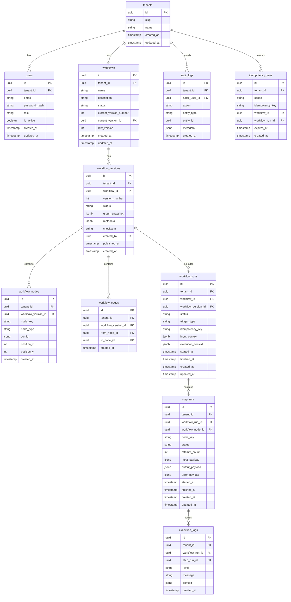

# FlowForge — Database Design v1

**Status:** Draft v1
**Target:** MVP for a modular monolith workflow orchestration engine
**Database:** PostgreSQL 17
**Cache/Queue Support:** Redis
**Design Style:** Relational-first with JSONB snapshots for workflow definitions and execution context

---

## 1. Database Goals

The database must support:

- multi-tenant isolation
- user authentication and role-based access control
- workflow CRUD and versioning
- DAG storage for workflow definitions
- workflow execution runs and step runs
- execution logs and audit logs
- safe concurrent worker execution
- idempotent trigger handling
- query performance for workflow list, run history, and logs
- a clean path for TDD-driven development

The database should be simple enough for an MVP, but structured enough to scale into a production-grade workflow platform.

---

## 2. Database Principles

### 2.1 PostgreSQL is source of truth

All durable business state lives in PostgreSQL.
Redis is only for queueing, coordination, and ephemeral cache.

### 2.2 Immutable execution history

Workflow runs, step runs, execution logs, and audit logs are append-only after write.
Published workflow versions are immutable.

### 2.3 Version everything important

Workflow changes create new versions instead of mutating published definitions.
Execution always references a specific workflow version.

### 2.4 Tenant-aware by default

Every tenant-owned table must contain `tenant_id`.
Every query must be scoped by `tenant_id`.

### 2.5 Hybrid storage for workflow definitions

Use relational tables (`workflow_nodes`, `workflow_edges`) for normalized indexing, foreign key constraints, and diff queries, and a JSONB snapshot (`workflow_versions.graph_snapshot`) for fast, atomic, and race-free worker execution.

Draft edits create/update a `workflow_versions` record with `status = 'draft'`. Upon publication, `status` switches to `'published'`, making the version snapshot immutable and updating `workflows.current_version_id`.

### 2.6 Keep transaction boundaries small

Use one transaction per business operation.
Do not keep long-lived transactions open during workflow execution.

### 2.7 Prefer explicit constraints

Use foreign keys, unique constraints, and check constraints instead of relying only on application code.

### 2.8 Testability first

Schema and repository design must support unit tests, integration tests, and concurrency tests.

---

## 3. Technology Decisions

### 3.1 Primary database

- PostgreSQL 17

### 3.2 Queue / ephemeral coordination

- Redis

### 3.3 Migration tool

- `golang-migrate` or equivalent migration tool

### 3.4 Primary key strategy

- UUID v7 preferred
- UUID v4 acceptable if UUID v7 is not available in the chosen library

### 3.5 JSON strategy

- JSONB for workflow snapshots, node configuration, execution output, and AI metadata

---

## 4. Domain Model

### 4.1 Identity domain

- Tenant
- User
- Role

### 4.2 Workflow domain

- Workflow
- WorkflowVersion
- WorkflowNode
- WorkflowEdge

### 4.3 Execution domain

- WorkflowRun
- StepRun
- ExecutionLog

### 4.4 Operational domain

- IdempotencyKey
- AuditLog
- OutboxEvent (future-ready, optional in MVP)

---

## 5. Aggregate Boundaries

### 5.1 Tenant aggregate

Root: `tenants`

- owns user membership and tenant identity

### 5.2 Workflow aggregate

Root: `workflows`

- owns workflow metadata
- owns published/current version pointer
- version snapshots belong to workflow
- nodes and edges belong to workflow version

### 5.3 Execution aggregate

Root: `workflow_runs`

- owns a single workflow execution
- owns step runs and execution logs
- execution state is derived from run + step runs

### 5.4 Audit aggregate

Root: `audit_logs`

- records business events like publish, rollback, delete, role change, and login events

---

## 6. Entity Relationship Diagram



---

## 7. Table Specifications

## 7.1 tenants

Purpose: workspace boundary.

Columns:

- `id` UUID PK
- `slug` unique tenant identifier
- `name` display name
- `created_at`
- `updated_at`

Constraints:

- `slug` unique
- `name` not null

Indexes:

- `unique(slug)`

---

## 7.2 users

Purpose: tenant-scoped user accounts.

Columns:

- `id` UUID PK
- `tenant_id` FK → tenants.id
- `email`
- `password_hash`
- `role` (`admin`, `editor`, `viewer`)
- `is_active`
- `created_at`
- `updated_at`

Constraints:

- unique `(tenant_id, email)`
- role check constraint
- password hash not null

Indexes:

- `(tenant_id, email)` unique
- `(tenant_id, role)`

---

## 7.3 workflows

Purpose: workflow metadata and current version pointer.

Columns:

- `id` UUID PK
- `tenant_id` FK
- `name`
- `description`
- `status` (`draft`, `published`, `archived`, `disabled`)
- `current_version_number`
- `current_version_id` FK → workflow_versions.id
- `row_version` optimistic locking counter
- `created_at`
- `updated_at`

Constraints:

- unique `(tenant_id, name)` recommended
- `status` check constraint
- `row_version >= 0`

Indexes:

- `(tenant_id, status, updated_at desc)`
- `(tenant_id, name)`

---

## 7.4 workflow_versions

Purpose: immutable published or draft snapshot of a workflow definition.

Columns:

- `id` UUID PK
- `tenant_id` FK
- `workflow_id` FK
- `version_number`
- `status` (`draft`, `published`, `archived`)
- `graph_snapshot` JSONB
- `metadata` JSONB
- `checksum`
- `created_by` FK → users.id
- `published_at`
- `created_at`

Constraints:

- unique `(workflow_id, version_number)`
- published versions must be immutable at application layer
- `graph_snapshot` not null

Indexes:

- `(tenant_id, workflow_id, version_number desc)`
- GIN on `graph_snapshot` if needed for schema inspection

---

## 7.5 workflow_nodes

Purpose: normalized node storage for validation, query, and diff.

Columns:

- `id` UUID PK
- `tenant_id` FK
- `workflow_version_id` FK
- `node_key` stable key within a version
- `node_type`
- `config` JSONB
- `position_x`
- `position_y`
- `created_at`

Constraints:

- unique `(workflow_version_id, node_key)`
- node type check constraint
- `config` not null

Indexes:

- `(workflow_version_id, node_key)` unique
- `(tenant_id, workflow_version_id)`

---

## 7.6 workflow_edges

Purpose: normalized edge storage.

Columns:

- `id` UUID PK
- `tenant_id` FK
- `workflow_version_id` FK
- `from_node_id` FK
- `to_node_id` FK
- `created_at`

Constraints:

- unique `(workflow_version_id, from_node_id, to_node_id)`
- `from_node_id != to_node_id`
- edges must belong to the same workflow version

Indexes:

- `(workflow_version_id, from_node_id)`
- `(workflow_version_id, to_node_id)`

---

## 7.7 workflow_runs

Purpose: execution record for one run of one workflow version.

Columns:

- `id` UUID PK
- `tenant_id` FK
- `workflow_id` FK
- `workflow_version_id` FK
- `status` (`pending`, `running`, `succeeded`, `failed`, `canceled`, `timed_out`)
- `trigger_type` (`manual`, `webhook`, `cron` future-ready)
- `idempotency_key`
- `input_context` JSONB
- `execution_context` JSONB
- `started_at`
- `finished_at`
- `created_at`
- `updated_at`

Constraints:

- `status` check constraint
- unique `(tenant_id, idempotency_key)` when idempotency key is present
- `workflow_version_id` must belong to same workflow and tenant

Indexes:

- `(tenant_id, workflow_id, created_at desc)`
- `(tenant_id, status, created_at desc)`
- `(tenant_id, workflow_version_id, created_at desc)`

---

## 7.8 step_runs

Purpose: execution record for each workflow node in a run.

Columns:

- `id` UUID PK
- `tenant_id` FK
- `workflow_run_id` FK
- `workflow_node_id` FK
- `node_key`
- `status` (`pending`, `ready`, `running`, `succeeded`, `failed`, `retrying`, `skipped`)
- `attempt_count`
- `input_payload` JSONB
- `output_payload` JSONB
- `error_payload` JSONB
- `started_at`
- `finished_at`
- `created_at`
- `updated_at`

Constraints:

- unique `(workflow_run_id, workflow_node_id)`
- `attempt_count >= 0`
- status check constraint

Indexes:

- `(workflow_run_id, status)`
- `(tenant_id, workflow_run_id)`
- `(tenant_id, workflow_node_id)`

---

## 7.9 execution_logs

Purpose: append-only runtime logs.

Columns:

- `id` UUID PK
- `tenant_id` FK
- `workflow_run_id` FK
- `step_run_id` nullable FK
- `level` (`debug`, `info`, `warn`, `error`)
- `message`
- `context` JSONB
- `created_at`

Constraints:

- append-only
- `message` not null

Indexes:

- `(workflow_run_id, created_at asc)`
- `(tenant_id, workflow_run_id, created_at asc)`
- `(step_run_id, created_at asc)`

---

## 7.10 audit_logs

Purpose: record business actions and administrative changes.

Columns:

- `id` UUID PK
- `tenant_id` FK
- `actor_user_id` FK
- `action`
- `entity_type`
- `entity_id`
- `metadata` JSONB
- `created_at`

Indexes:

- `(tenant_id, created_at desc)`
- `(tenant_id, entity_type, entity_id)`

---

## 7.11 idempotency_keys

Purpose: deduplication for trigger requests and future external callbacks.

Columns:

- `id` UUID PK
- `tenant_id` FK
- `scope` (`workflow_trigger`, `webhook`, `api_request`)
- `idempotency_key`
- `workflow_id` nullable FK
- `workflow_run_id` nullable FK
- `expires_at`
- `created_at`

Constraints:

- unique `(tenant_id, scope, idempotency_key)`

Indexes:

- `(tenant_id, scope, idempotency_key)` unique
- `(expires_at)` for cleanup job

---

## 8. Constraint Strategy

### 8.1 Foreign keys

Use foreign keys across all core relationships.
This keeps data integrity high and reduces the chance of orphan records.

### 8.2 Check constraints

Use check constraints for:

- workflow status
- run status
- step status
- role values
- node types
- log levels

### 8.3 Unique constraints

Use unique constraints for:

- tenant slug
- user email per tenant
- workflow version number per workflow
- node key per workflow version
- edge uniqueness per workflow version
- idempotency key uniqueness

### 8.4 Soft delete policy

Soft delete is allowed only for business entities such as workflows and users if needed.
Execution records and logs should not be soft deleted because they are audit history.

---

## 9. Indexing Strategy

### 9.1 Tenant-first indexes

Most query patterns are tenant-scoped.
Every high-traffic table should include an index that begins with `tenant_id`.

### 9.2 Common list patterns

Typical queries:

- workflow list
- run history list
- step runs for a run
- logs for a run

Recommended indexes:

- `workflows(tenant_id, status, updated_at desc)`
- `workflow_runs(tenant_id, workflow_id, created_at desc)`
- `workflow_runs(tenant_id, status, created_at desc)`
- `step_runs(workflow_run_id, status)`
- `execution_logs(workflow_run_id, created_at asc)`

### 9.3 JSONB indexes

Use GIN only when a real query pattern needs JSONB lookup.
Do not add GIN indexes to every JSONB column by default.

### 9.4 Covering indexes

Use `INCLUDE` when list pages only need a small number of extra columns.
This helps reduce heap reads.

---

## 10. JSONB Strategy

### 10.1 Use JSONB for flexible payloads

Good JSONB candidates:

- `workflow_versions.graph_snapshot`
- `workflow_nodes.config`
- `workflow_runs.input_context`
- `workflow_runs.execution_context`
- `step_runs.input_payload`
- `step_runs.output_payload`
- `step_runs.error_payload`
- `execution_logs.context`
- `audit_logs.metadata`

### 10.2 Do not overuse JSONB

Do not store core identifiers, status fields, or tenant boundaries only in JSONB.
Those belong in relational columns.

### 10.3 Snapshot vs normalized data

- Normalized tables are used for integrity and queryability.
- JSONB snapshots are used for fast reload and version audit.

This hybrid model gives both flexibility and strong data rules.

---

## 11. Locking Strategy

### 11.1 Optimistic locking

Use for workflow edits.

Pattern:

- `workflows.row_version` increments on successful update.
- Updates fail when the expected version does not match.

Example:

```sql
UPDATE workflows
SET name = $1,
    description = $2,
    row_version = row_version + 1,
    updated_at = now()
WHERE id = $3
  AND tenant_id = $4
  AND row_version = $5;
```

### 11.2 Pessimistic locking / atomic claim

Use for workflow run and step run execution.

Preferred patterns:

- `UPDATE ... WHERE status = 'pending' RETURNING id`
- `SELECT ... FOR UPDATE SKIP LOCKED`

Use these to avoid duplicate worker execution.

### 11.3 Idempotent trigger writes

Trigger requests should insert into `idempotency_keys` or use a uniqueness guard before creating runs.

### 11.4 Locking summary

| Area            | Strategy                               |
| --------------- | -------------------------------------- |
| Workflow edit   | Optimistic locking                     |
| Version publish | Optimistic locking + transaction       |
| Run claim       | Atomic claim / pessimistic lock        |
| Step claim      | Atomic claim / pessimistic lock        |
| Trigger dedup   | Idempotency key                        |
| Logs            | Append-only, no locking logic required |

---

## 12. Transaction Strategy

### 12.1 Short transactions only

Transactions should cover a single business action such as:

- create workflow
- publish version
- trigger run
- claim run
- persist step result

### 12.2 Execution is not one giant transaction

Do not keep a workflow run inside one DB transaction from start to finish.
Each step or state transition is persisted independently.

### 12.3 Publish workflow transaction

A publish operation should atomically:

- validate draft data
- create workflow version snapshot
- create normalized nodes and edges
- update workflow current version pointer
- write audit log

### 12.4 Trigger workflow transaction

A trigger operation should atomically:

- validate idempotency key
- create workflow run record
- enqueue job metadata
- write audit log

### 12.5 Worker execution transaction

The worker should use separate transactions for:

- claim run
- claim step
- persist step result
- finalize run

This keeps lock scope small and retry behavior safe.

---

## 13. Query Optimization

## 13.1 Run history query

The run history page is one of the most important queries.

Example:

```sql
SELECT id, workflow_id, status, trigger_type, started_at, finished_at, created_at
FROM workflow_runs
WHERE tenant_id = $1
  AND workflow_id = $2
  AND created_at >= $3
ORDER BY created_at DESC
LIMIT 50;
```

Recommended index:

```sql
CREATE INDEX idx_workflow_runs_history
  ON workflow_runs (tenant_id, workflow_id, created_at DESC)
  INCLUDE (status, trigger_type, started_at, finished_at);
```

Reasoning:

- `tenant_id` narrows tenant scope first.
- `workflow_id` supports per-workflow filtering.
- `created_at DESC` supports recent-first pagination.
- `INCLUDE` enables more index-only reads for list pages.

---

## 14. Migration Strategy

### 14.1 Migration tool

Use a simple SQL migration tool such as `golang-migrate`.

### 14.2 Migration rules

- every schema change must have an up and down migration
- migrations must be reversible when possible
- destructive changes should be split into safe steps
- backfills should be separated from schema creation when needed

### 14.3 Safe change examples

Good patterns:

- add nullable column first
- backfill data
- make column non-null later
- create index concurrently when needed
- drop old column only after code has switched

### 14.4 Versioning changes

Workflow version table schema should be stable early.
If version shape changes later, add a migration and preserve backward compatibility where possible.

---

## 15. Backup and Recovery

### 15.1 Backup strategy

- PostgreSQL logical backup for MVP
- regular automated dumps in local or cloud deployment

### 15.2 Recovery strategy

- restore from latest successful snapshot
- replay if an outbox/event log is added later
- durable execution state remains in PostgreSQL

### 15.3 Data safety priorities

Highest priority data:

1. tenant records
2. workflow versions
3. workflow runs
4. step runs
5. logs

---

## 16. Security

### 16.1 Tenant isolation

Every tenant-owned table contains `tenant_id`.
Repositories must always filter by `tenant_id`.

### 16.2 Sensitive data

Do not store secrets in execution logs.
Redact sensitive values from payloads before logging.

### 16.3 Auditability

Use `audit_logs` for:

- publish
- rollback
- delete
- role change
- login/logout

### 16.4 Optional RLS

PostgreSQL Row-Level Security can be added later, but application-level tenant filtering is acceptable for MVP if enforced consistently and tested thoroughly.

---

## 17. Future Evolution

### 17.1 Scaling logs

If log volume grows, move execution logs to a dedicated log store such as Loki, OpenSearch, or ClickHouse.

### 17.2 Stronger tenant enforcement

Add PostgreSQL RLS when the app reaches a larger scale.

### 17.3 Event outbox

If async integration grows, add outbox-driven publishing.

### 17.4 More node types

Add loop, webhook wait, compensation, and custom script nodes later.

### 17.5 Partitioning

If workflow runs and logs become very large, consider partitioning by time.

---

## 18. Definition of Done

The database design is ready when:

- workflow CRUD can be stored safely
- workflow versioning is immutable after publish
- DAG nodes and edges are queryable
- workflow runs and step runs are append-only
- idempotency works for triggers
- locking strategy prevents duplicate execution
- queries for list pages are indexed
- migration path is clear
- schema supports TDD and integration testing

---

## 19. Recommended Positioning

This database design is intentionally MVP-friendly, but production-aware.
It favors correctness, testability, and tenant safety over premature optimization.
