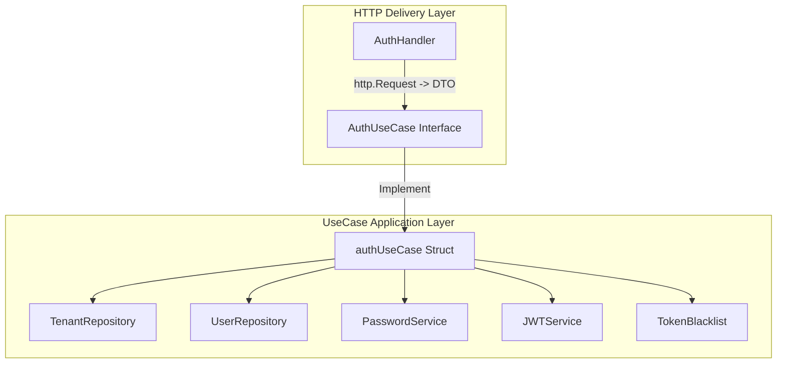

# Implementation Plan — Clean Architecture Refactoring for Auth Module

This implementation plan outlines the refactoring of `internal/auth` to establish strict Clean Architecture layer separation between the **Application UseCase Layer** (`usecase.go`) and the **HTTP Delivery Layer** (`handler.go`), as mandated by Project Rule 4 in `.agents/AGENTS.md`.

---

## User Review Required

> [!IMPORTANT]
> - **UseCase Layer (`internal/auth/usecase.go`)**: All business logic (tenant lookup, user credentials checking, timing-attack defense via `dummyBcryptHash`, token generation, token rotation on refresh, JTI token revocation on logout) will move from `AuthHandler` into `AuthUseCase`.
> - **Zero `net/http` Dependencies in UseCase**: `AuthUseCase` methods accept `context.Context` and primitives/DTOs (`tenantSlug`, `email`, `password`, `refreshToken`, `accessToken`), returning domain structs (`AuthResult`, `domain.User`) and sentinel errors.
> - **HTTP Delivery Layer (`internal/auth/handler.go`)**: `AuthHandler` will depend exclusively on `AuthUseCase`. Handlers will only decode HTTP request JSON, invoke `AuthUseCase` methods, and map domain errors to HTTP status codes (`400`, `401`, `403`, `500`).
> - **Bootstrap (`cmd/api/main.go`)**: Instantiate `AuthUseCase`, then pass it into `NewAuthHandler(authUseCase)`.

---

## Open Questions

- None. All layer boundaries strictly follow the 4-tier Clean Architecture standard.

---

## Refactoring Architecture Diagram

---

## Proposed Changes

### Application UseCase Layer

#### [NEW] [usecase.go](file:///home/mohyasiralfarizi/Golang/flowforge/internal/auth/usecase.go)
- Define `AuthResult` struct (`AccessToken`, `RefreshToken`, `ExpiresIn`, `User *domain.User`).
- Define `AuthUseCase` interface:
  - `Login(ctx context.Context, tenantSlug, email, password string) (*AuthResult, error)`
  - `Refresh(ctx context.Context, refreshToken string) (*AuthResult, error)`
  - `Logout(ctx context.Context, accessToken string) error`
  - `GetMe(ctx context.Context, userID, tenantID uuid.UUID) (*domain.User, error)`
- Implement `authUseCase` struct containing `tenantRepo`, `userRepo`, `jwtService`, `passSvc`, `blacklist`.
- Move business rules (timing attack constant-time comparisons, inactive checks, token rotation, JTI revocation) into `authUseCase`.

#### [NEW] [usecase_test.go](file:///home/mohyasiralfarizi/Golang/flowforge/internal/auth/usecase_test.go)
- Unit test suite for `AuthUseCase` testing all business paths (successful login, invalid tenant, invalid password, inactive user, token refresh rotation, and logout revocation).

---

### HTTP Delivery Layer

#### [MODIFY] [handler.go](file:///home/mohyasiralfarizi/Golang/flowforge/internal/auth/handler.go)
- Refactor `AuthHandler` to depend solely on `useCase AuthUseCase`.
- Refactor `Login(w, r)`: Decode `LoginRequest` JSON -> Call `h.useCase.Login(...)` -> Map errors to HTTP responses.
- Refactor `Refresh(w, r)`: Decode `RefreshRequest` JSON -> Call `h.useCase.Refresh(...)` -> Map errors to HTTP responses.
- Refactor `Logout(w, r)`: Extract Bearer token -> Call `h.useCase.Logout(...)` -> Return standard JSON response.
- Refactor `GetMe(w, r)`: Extract `AuthUser` from context -> Call `h.useCase.GetMe(...)` -> Return user JSON response.

#### [MODIFY] [handler_test.go](file:///home/mohyasiralfarizi/Golang/flowforge/internal/auth/handler_test.go)
- Update handler tests to construct `AuthHandler` with `AuthUseCase` (or mock usecase) and verify HTTP status code mappings.

---

### Wiring & Entrypoint

#### [MODIFY] [main.go](file:///home/mohyasiralfarizi/Golang/flowforge/cmd/api/main.go)
- Instantiate `authUseCase := auth.NewAuthUseCase(tenantRepo, userRepo, jwtService, passSvc, tokenBlacklist)`.
- Instantiate `authHandler := auth.NewAuthHandler(authUseCase)`.

---

## Verification Plan

### Automated Tests
- Run `go test -v -race ./internal/auth/...` to verify all usecase and handler unit tests pass cleanly.
- Run full project test suite: `go test -v -race ./...` to verify zero data races and 100% test pass rate.

### Manual Verification
- Run local stack via `docker compose up`.
- Perform HTTP request `POST /api/v1/auth/login` and `GET /api/v1/users/me` to ensure endpoint behavior remains 100% backward compatible.
